### Escuela Colombiana de Ingeniería
### Arquitecturas de Software - ARSW
#### 👩🏼‍💻👨🏻‍💻 AUTORES: [Saray Alieth Mendivelso Gonzalez](https://github.com/saraygonm) y [Miguel Camilo Tellez Ávila](https://github.com/miguel-tellez)

## Escalamiento en Azure con Maquinas Virtuales, Sacale Sets y Service Plans

### Dependencias
* Cree una cuenta gratuita dentro de Azure. Para hacerlo puede guiarse de esta [documentación](https://azure.microsoft.com/es-es/free/students/). Al hacerlo usted contará con $100 USD para gastar durante 12 meses.
Antes de iniciar con el laboratorio, revise la siguiente documentación sobre las [Azure Functions](https://www.c-sharpcorner.com/article/an-overview-of-azure-functions/)

### 📍Parte 0 - Entendiendo el escenario de calidad

Adjunto a este laboratorio usted podrá encontrar una aplicación totalmente desarrollada que tiene como objetivo calcular el enésimo valor de la secuencia de Fibonnaci.

**Escalabilidad**
Cuando un conjunto de usuarios consulta un enésimo número (superior a 1000000) de la secuencia de Fibonacci de forma concurrente y el sistema se encuentra bajo condiciones normales de operación, todas las peticiones deben ser respondidas y el consumo de CPU del sistema no puede superar el 70%.

### Escalabilidad Serverless (Functions)

1. Cree una Function App tal cual como se muestra en las  imagenes.

- Escogemos la opción de consumo

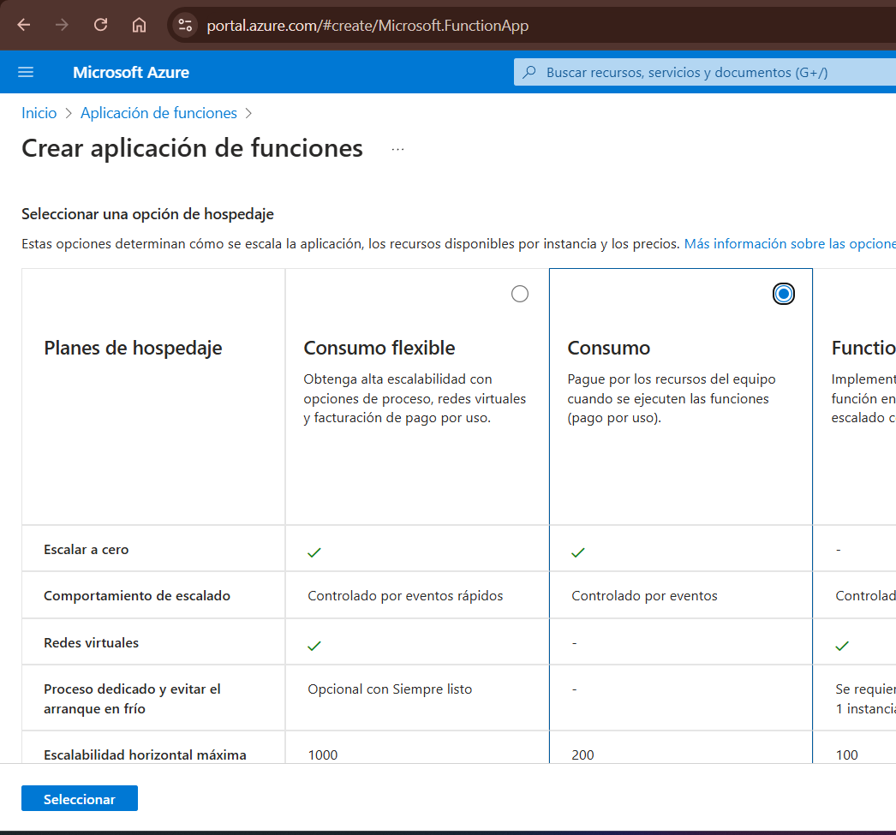

- Seleccionamos las opciones anteriores.

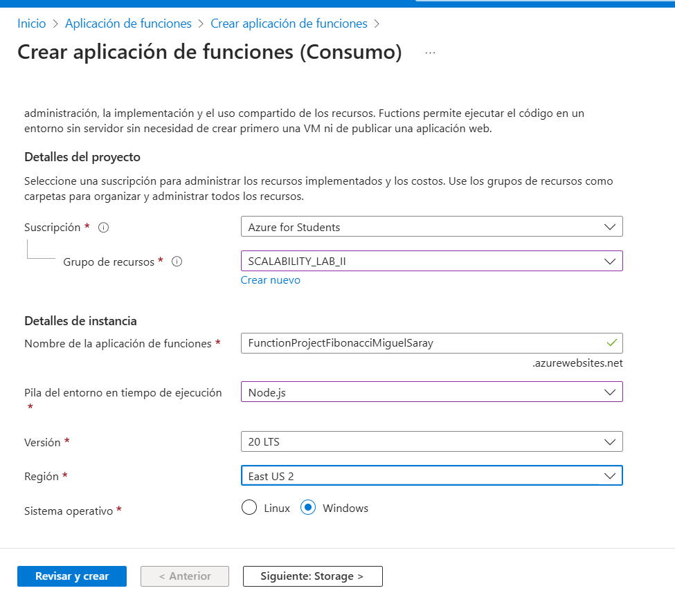

2. Instale la extensión de **Azure Functions** para Visual Studio Code.

- Descargamos la extensión en VisualStudioCode

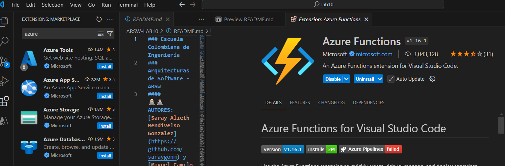

- Descargamos la extensión Azure Account

- Cambiamos la versión en el Host.json

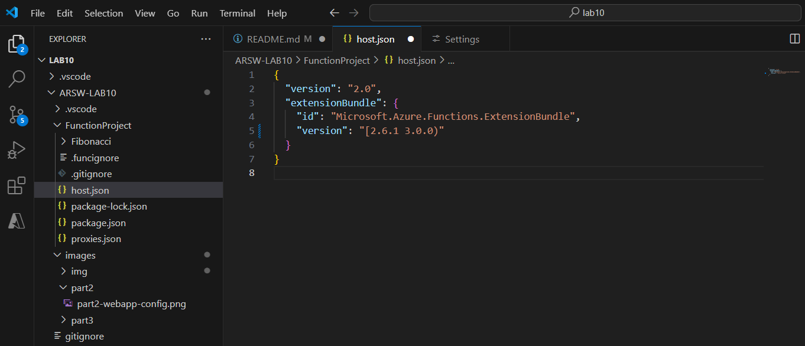

- Si nos dirijimos al portal de azure observamos este error

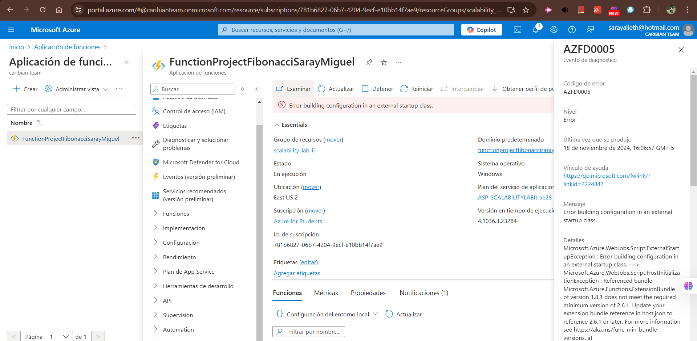

3. Despliegue la Function de Fibonacci a Azure usando Visual Studio Code. La primera vez que lo haga se le va a pedir autenticarse, siga las instrucciones.

- Realizado:

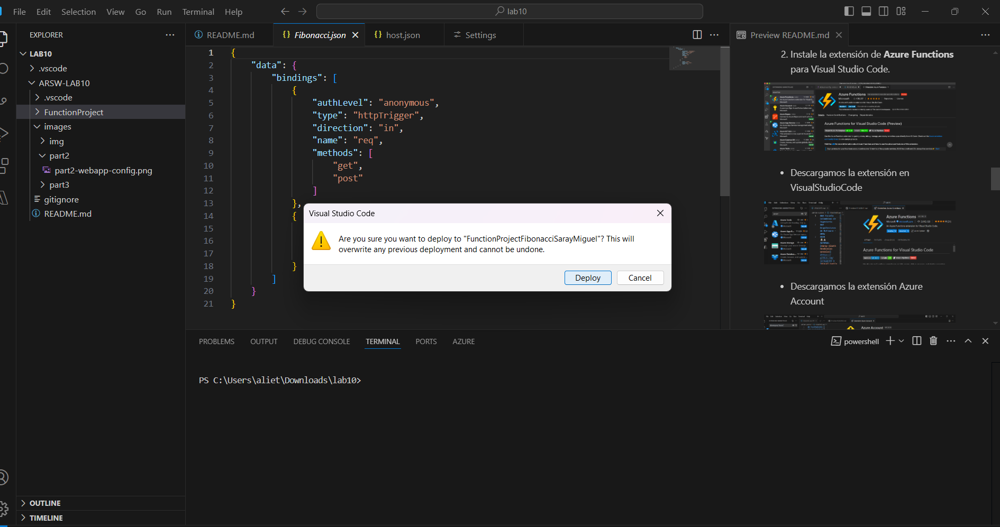

4. Dirijase al portal de Azure y pruebe la function.

- Observamos que se ha conectado exitosamente!:

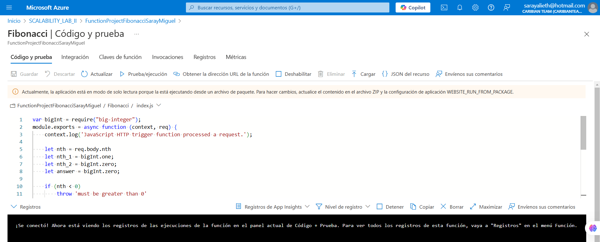

<!-- Creación de tabla para alinear las imágenes lado a lado.-->
| 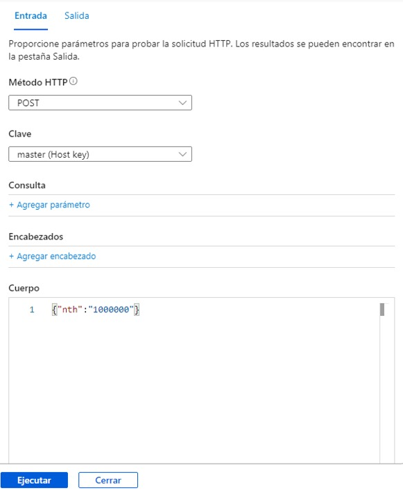 | 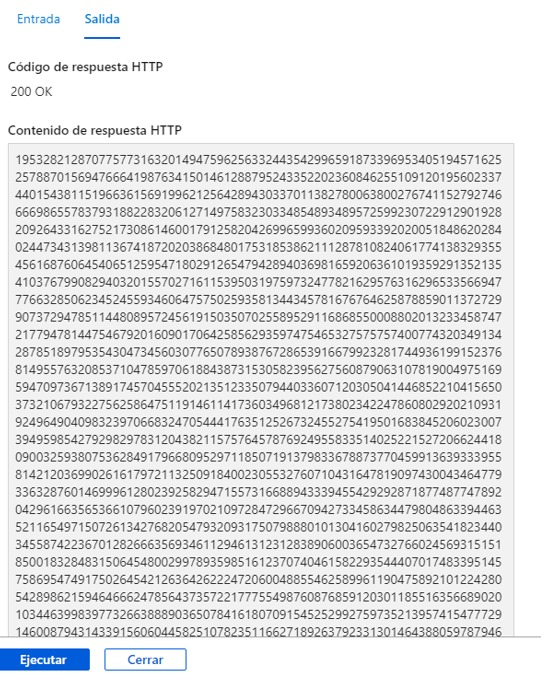 |
|---------------------------------------------------------------------|---------------------------------------------------------------|
| **Imagen 1: Ejecución Prueba**                                        | **Imagen 2: Respuesta prueba**                               |

5. Modifique la coleción de POSTMAN con NEWMAN de tal forma que pueda enviar 10 peticiones concurrentes. Verifique los resultados y presente un informe.

    1. **Actualización del valor de `VM1` en el archivo de entorno:**
   - Se modificó para apuntar a `"functionprojectfibonacci2.azurewebsites.net"`, que corresponde al servicio alojado en Azure.
    

    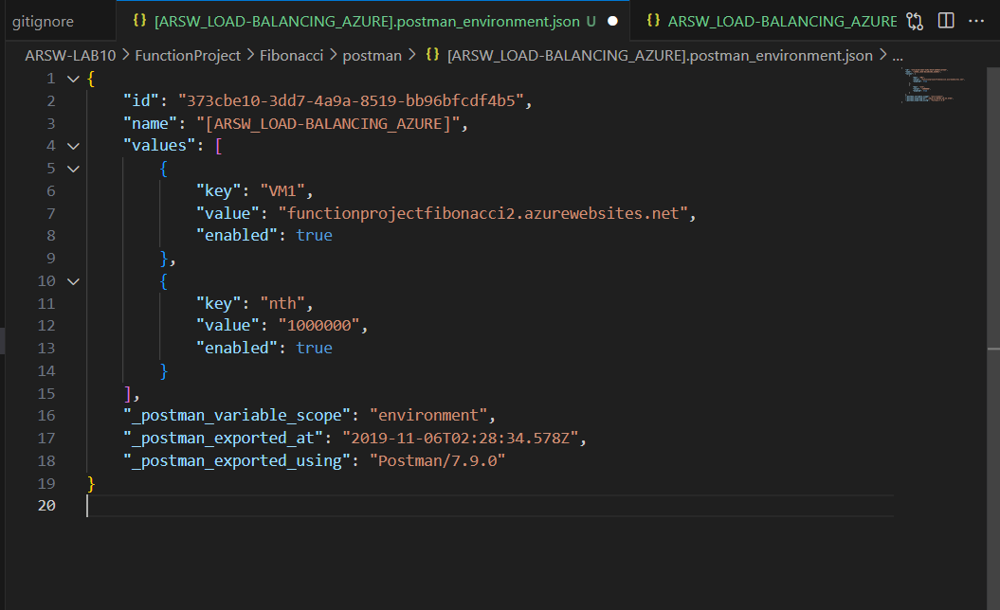
    

    2. **Modificación de la solicitud HTTP en el archivo de la colección:**
   - Cambio del método HTTP: ahora se utiliza `POST`.
   - Actualización de la URL, el host, y el protocolo: se configuró para usar `https`.

   - Se añadió un cuerpo a la solicitud `POST` en el archivo de la colección, especificando los datos que serán enviados en la petición.

    

    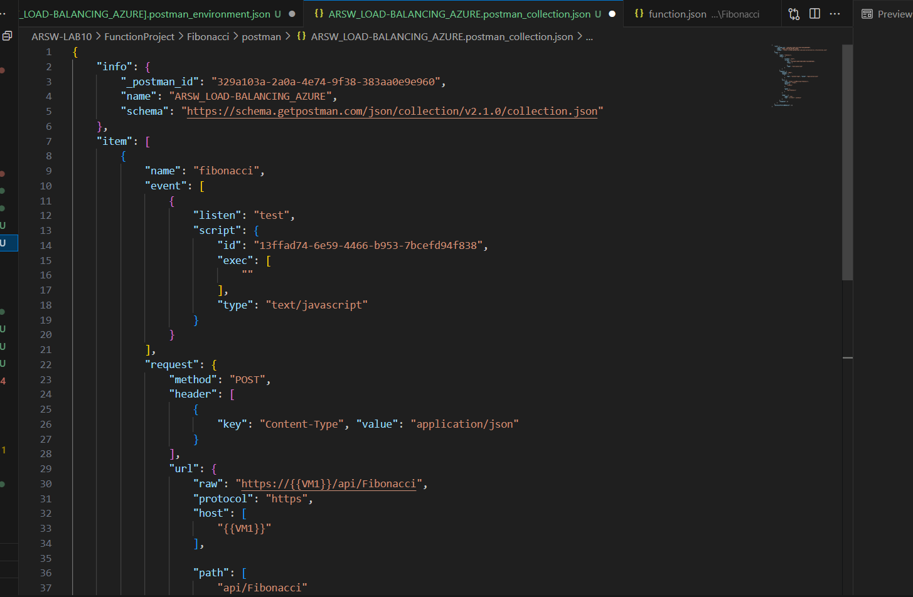
    

  

    3. **Adición de un encabezado:**
   - Se agregó un encabezado indicando que el contenido del cuerpo de la solicitud estará en formato `JSON`.

6. Cree una nueva Function que resuleva el problema de Fibonacci pero esta vez utilice un enfoque recursivo con memoization. Pruebe la función varias veces, después no haga nada por al menos 5 minutos. Pruebe la función de nuevo con los valores anteriores. ¿Cuál es el comportamiento?.

- Para implementar la técnica de memoización, se deben almacenar los resultados previamente calculados para evitar cálculos repetitivos. (Archivo index.js)
    

    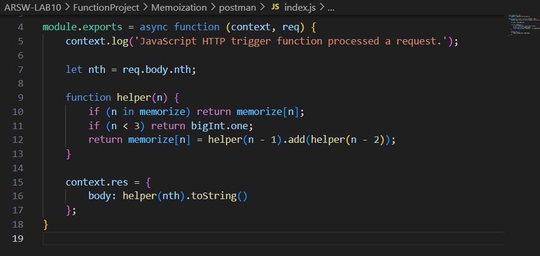
    

- Ahora creamos los archivos de postman, modificando la URL

    

    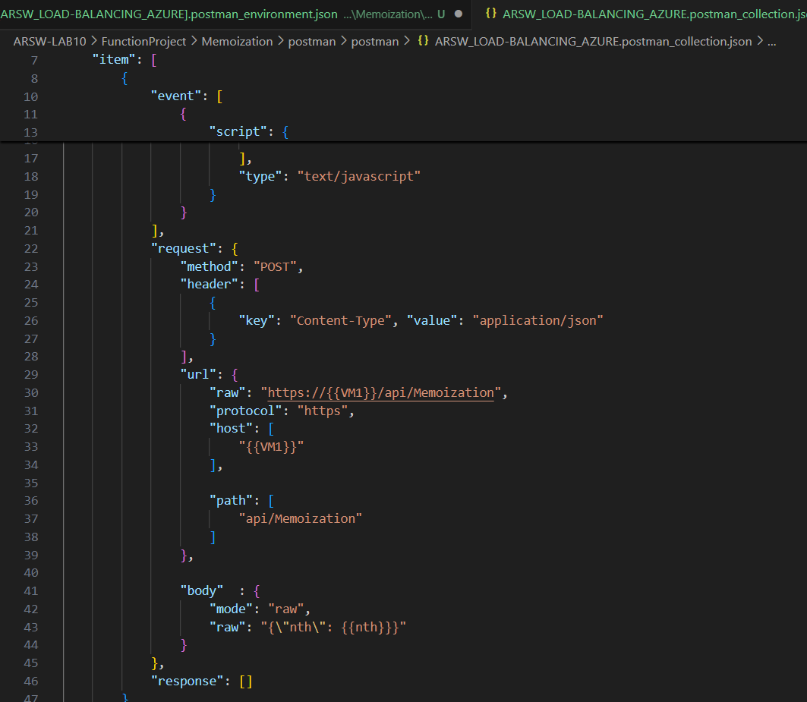
    

# Pruebas y Resultados

## Primeras pruebas  

- Verificar todo funcione: 

  

En las primeras pruebas realizadas, como se observa en la imagen, todas las solicitudes arrojaron un error **500**, indicando un problema en el servidor. Este fallo podría deberse a la falta de recursos para procesar las peticiones, lo que nos llevó a probar con un valor de `nth` más pequeño.

## Resultados

- **Con `nth = 1000000`**  

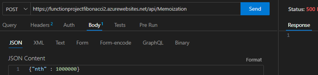

  

- **Con `nth = 10`**  

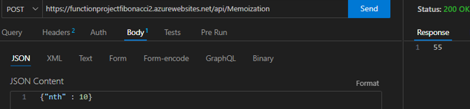

   

Estos resultados nos llevaron a concluir que las peticiones fallan cuando el número solicitado (`nth`) es demasiado grande. Según nuestra investigación, el problema radica en que JavaScript tiene un límite de profundidad en la recursividad de aproximadamente **10,000 llamadas**. Para confirmar esto, realizamos una prueba con `nth = 10,000` usando Newman para evaluar el desempeño del nuevo algoritmo.

## Resultados con `nth = 10,000`  

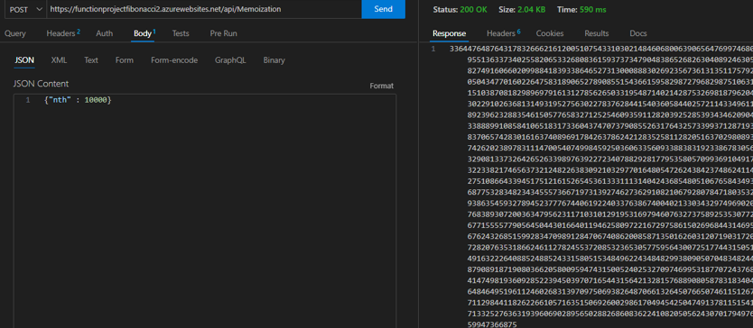

  

El algoritmo funcionó correctamente con este valor, por lo que actualizamos el archivo de entorno en Postman con este nuevo valor de `nth`.

## Pruebas finales en Postman  
Procedimos a realizar pruebas adicionales en Postman, y los resultados indicaron que todo funcionó de manera correcta.  

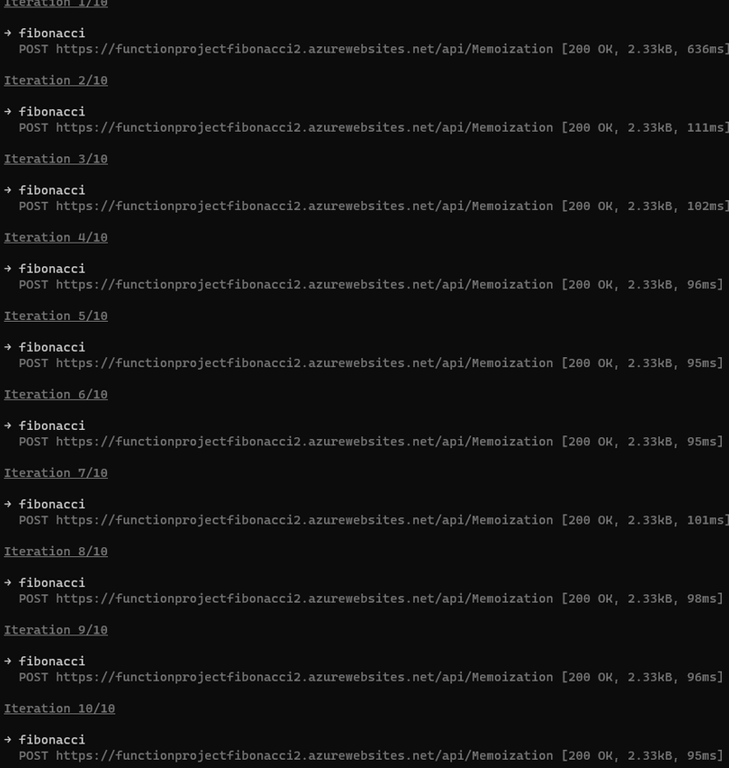

  

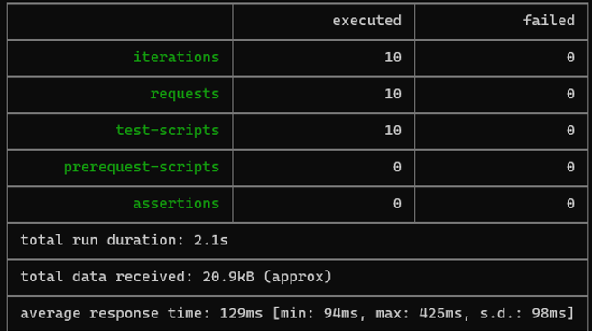

  

## Observaciones tras varias ejecuciones  
Al ejecutar el comando repetidamente, observamos en el reporte que la **primera solicitud a la API** es la que tiene el mayor tiempo de respuesta, mientras que las siguientes muestran una mejora considerable en los tiempos de ejecución.

---

# Pruebas después de 5 minutos de inactividad  

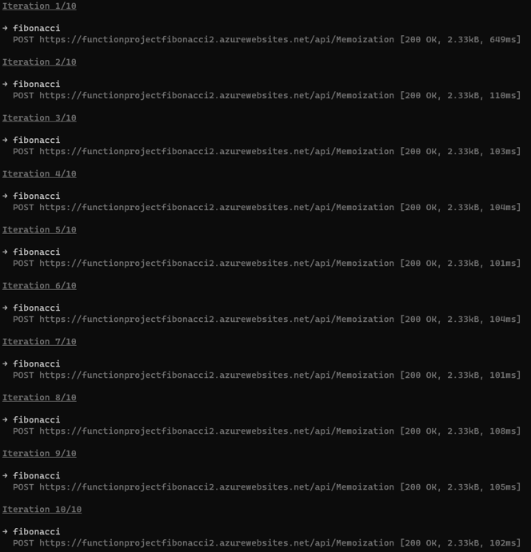

  

Luego de esperar 5 minutos, notamos que el tiempo de respuesta del **primer llamado** a la función aumentó en aproximadamente **200 milisegundos**, alcanzando un tiempo similar al de la primera solicitud realizada en las pruebas iniciales.

Aunque un incremento de 200 milisegundos puede parecer poco, este comportamiento podría explicarse por la **propiedad de "Function Timeout"** en las Function Apps de Azure. Esta característica provoca que, tras un período de inactividad, la memoria asignada al componente sea liberada, lo que obliga al sistema a reinicializarse en la siguiente solicitud, generando un mayor tiempo de respuesta.

---

Los resultados confirman que el problema original estaba relacionado con el límite de recursividad de JavaScript y que los tiempos de inicialización adicionales tras un periodo de inactividad son esperados debido a la liberación de memoria en Azure Function Apps.

## ❓**Preguntas**

### 1. ¿Qué es un Azure Function?
Es un servicio de Microsoft Azure que permite ejecutar pequeñas piezas de código (funciones) 
en respuesta a eventos, sin necesidad de administrar infraestructura y 
ofreciendo una solución escalable para ejecutar lógica basada en eventos.

---

### 2. ¿Qué es serverless?
Serverless es un modelo de computación en la nube donde el proveedor administra la infraestructura. 
Los desarrolladores se enfocan solo en escribir y desplegar código, y la nube escala automáticamente los recursos
según la demanda. Aunque los servidores existen, son abstractos para el usuario.

---

### 3. ¿Qué es el runtime y qué implica seleccionarlo al momento de crear el Function App?
El runtime es el entorno de ejecución que interpreta y ejecuta el código de las funciones. 

Las implicaciones de su selección son:

- El lenguaje de programación (C#, Python, Node.js, etc.).
- Las versiones compatibles.
- La base para actualizar, mantener y ejecutar las funciones.

---

### 4. ¿Por qué es necesario crear un Storage Account junto con un Function App?
El Storage Account es una dependencia necesaria para el correcto funcionamiento de las Azure Functionses, pues ayuda a:
- Almacenar datos de configuración y estado de las funciones.
- Mantiener los archivos de registro y las colas de mensajes para triggers.
- Soportar la ejecución en modo Durable Functions (persistencia de estado).

.

---

### 5. ¿Cuáles son los tipos de planes para un Function App?

#### 1. **Plan de Consumo:**
- **Características**: Escala automáticamente en función de la demanda; pagas solo por el tiempo de ejecución.
- **Ventajas**: Bajo costo inicial, ideal para cargas variables.
- **Desventajas**: Latencia inicial (cold start), límite de ejecución de 5 minutos.

#### 2. **Plan Premium:**
- **Características**: Precalentamiento de instancias, mayor escalabilidad y acceso a redes privadas.
- **Ventajas**: Sin cold start, más rendimiento.
- **Desventajas**: Más caro que el plan de consumo.

#### 3. **Plan App Service:**
- **Características**: Usa instancias dedicadas compartidas con otras aplicaciones App Service.
- **Ventajas**: Control total sobre la infraestructura, ideal para aplicaciones siempre activas.
- **Desventajas**: No escala automáticamente, costos más altos para cargas variables.

---

### 6. ¿Por qué la memoization falla o no funciona de forma correcta?
La memoization puede fallar porque:
- **Persistencia en ambiente stateless**: Azure Functions se ejecutan en un entorno sin estado, y el almacenamiento en memoria se pierde entre ejecuciones.
- **Inconsistencias en el escalado**: Al escalar horizontalmente, múltiples instancias no comparten la misma memoria.
- **Errores en la implementación**: Pueden surgir problemas si no se manejan adecuadamente las claves o el almacenamiento del resultado.

---

### 7. ¿Cómo funciona el sistema de facturación de las Function App?
La facturación se basa en:
1. **Tiempo de ejecución**: Se mide en segundos y en unidades de GB-s (memoria consumida por segundo).
2. **Número de ejecuciones**: Se cobra según la cantidad de ejecuciones realizadas.

3. **Almacenamiento y networking**: Costo adicional por el uso del Storage Account y el tráfico de red.

El plan de Consumo incluye una capa gratuita con 1 millón de ejecuciones y 400,000 GB-s al mes.

* Informe

- Comando para enviar 10 peticiones concurrentes:

Ejecutamos el siguiente comando en la terminal para enviar 10 solicitudes concurrentes utilizando Newman (herramienta de línea de comandos para ejecutar colecciones de Postman):

`
newman run ARSW_LOAD-BALANCING_AZURE.postman_collection.json -e [ARSW_LOAD-BALANCING_AZURE].postman_environment.json -n 10 `

| 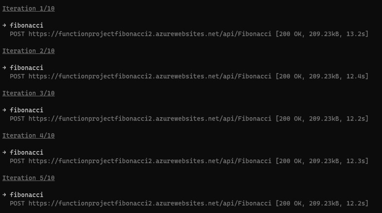 | 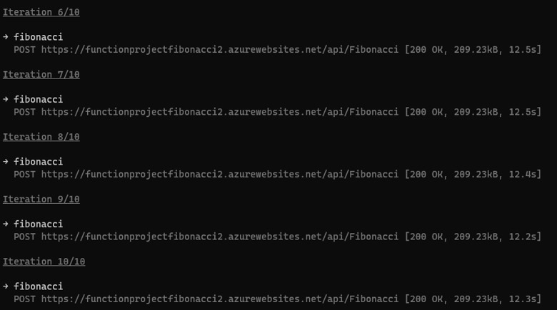 |
|---------------------------------------------------------------------|---------------------------------------------------------------|

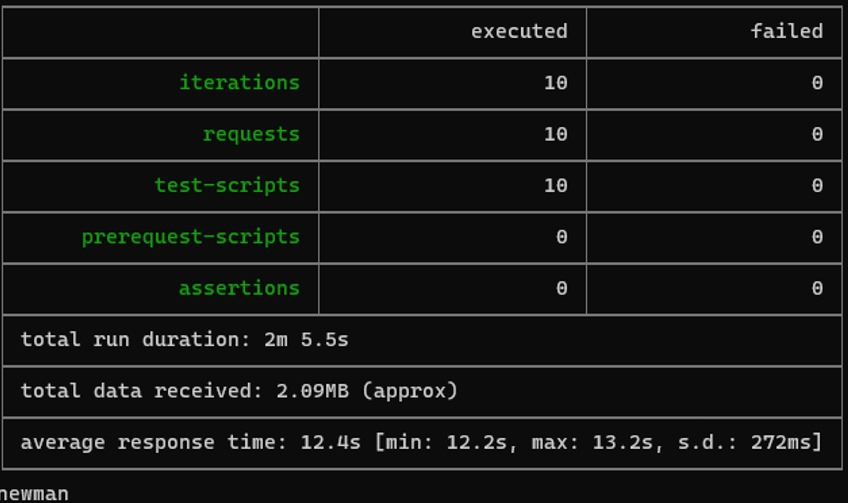

### Inferencias basadas en los resultados:

#### 1. **Resultados de las solicitudes concurrentes:**
- Se ejecutaron **10 iteraciones**, todas con éxito.
- Cada iteración corresponde a una solicitud `POST` hacia la URL.
- Tiempo promedio de respuesta: **12.4 segundos**.
  - Tiempo mínimo: **12.2 segundos**.
  - Tiempo máximo: **13.2 segundos**.
- Todas las solicitudes obtuvieron un código de estado **200 OK**, indicando que fueron procesadas correctamente por el servidor.

#### 2. **Resumen de desempeño:**
- **Duración total de ejecución:** Aproximadamente **2 minutos y 5.5 segundos**.
- **Datos recibidos:** Un total de **2.09 MB**, lo que implica que cada respuesta contenía aproximadamente **209.23 KB**.

#### 3. **Variabilidad en el tiempo de respuesta:**
- La desviación estándar del tiempo de respuesta fue de **272 ms**, mostrando consistencia en los tiempos de respuesta del servidor.

#### 4. **Servidor y balanceo de carga:**
- Todas las solicitudes fueron procesadas exitosamente, lo que sugiere que el servidor o el sistema de balanceo de carga está manejando eficientemente esta carga moderada (10 solicitudes concurrentes).
- No hubo errores ni solicitudes fallidas.

#### 5. **Conclusión:**
- El servicio es **estable bajo esta carga moderada**.
- Sin embargo, el tiempo promedio de respuesta (**12.4 segundos**) podría ser elevado dependiendo del contexto de uso. 
  - Si el cálculo de Fibonacci requiere manejar valores grandes, este tiempo podría ser razonable.
  - Si no, sería conveniente optimizar el servicio para mejorar su rendimiento.
